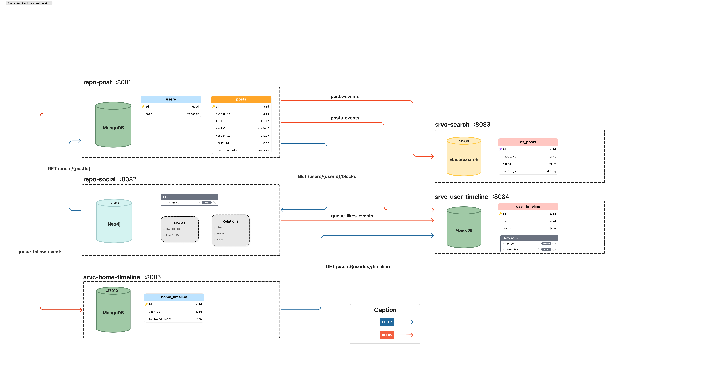

# TinyX Project
*A small-scale microblogging platform inspired by the social network X*

## 🔍 Overview

TinyX is a microservices-based project aiming to recreate a distributed micro-blogging application and inspired by the social network X.
It is designed to handle social media-like functionalities such as creating posts, managing user timelines, and interacting with posts.\
**_Please find more detailed information about the project below._**

>💡 For more detailed information about the API endpoints documentation, please refer to the swaggers available in the `./swaggers/` directory of the repository.

## 📌 Main Features
✅ **Create, Edit, Delete Posts with media content and replies**\
✅ **Follow / Unfollow Users**\
✅ **Block / Unblock Users**\
✅ **Interact with posts (Like / Unlike)**\
✅ **Search Functionality**\
✅ **Timeline Feed (Home and User)**\
✅ **Real-time Updates**

## 🛠️ **Tech Stack**
- **_Code_**: Java, Quarkus, Maven
- **_Databases_**: MongoDB, Neo4j, Elasticsearch
- **_Messaging_**: Redis
- **_Testing_**: JUnit, Mockito
- **_Deployment_**: Docker, Kubernetes

## 🚀 **Installation**
### **Prerequisites**
- A running k3s cluster
- Docker

### **Run the k8s cluster**

To deploy the services using the k3s cluster, navigate to the kubernetes directory configuration directory and run:

```sh
kubectl apply -k .
```
> 💡 Make sure your kubectl context is set to point to your k3s cluster.

All required service images should already be pushed to the EPITA container registry for successful deployment. The last version of each images is already deployed.
If you need to build and deploy an image yourself, you can follow these steps:

```sh
# Log in to the EPITA container registry
docker login registry.cri.epita.fr

# Build the Docker image for a specific service
docker build -t $SERVICE_NAME:$VERSION -f ./$SERVICE_NAME/Dockerfile .

# Push the Docker image to the registry
docker push registry.cri.epita.fr/ing/majeures/tc/info/student/2026/2025-epitweet-tinyx-18/$SERVICE_NAME:$VERSION
```

Once deployed on the cluster, each service will be accessible at:

```
http://<YOUR_K8S_CLUSTER_IP>/$SERVICE_NAME/
```

For example, if you'd like to query the "hello world" endpoint of repo-post, and you k3s cluster is running on 192.168.x.x you can use:

```sh
curl http://192.168.x.x/repo-post/api/hello
```


## 📦 Architecture

The project follows a modular, layered architecture with the following key services and repository.
The services communicate either via Redis messaging queues for asynchronous tasks, or via http requests for an immediate response.\
Here is an architecture diagram of the project:



### Modules

Below is a brief explanation of each module and its responsibilities:

1. **Common module (`common`)**:

   - Contains shared utilities, DTO object classes, and error handling mechanisms used across all services.
   - Includes request and response classes used for all API endpoints.
   - Includes custom exceptions and error codes for consistent error management.

2. **Docker module(`docker`)**:
   - Contains docker-compose files and databases init files for building and running the application in containers.
   - Provides a local development environment with all necessary services (MongoDB, Redis, etc.) using Docker Compose.

3. **Kubernetes module(`kubernetes`)**:
    - Contains Kubernetes customization and deployment files for deploying the application in a Kubernetes cluster.
    - Contains Dockerfiles for building the application images.
    - Contains the Kubernetes deployment for the databases and cluster networks.

4. **Repo Post (`repo-post`)** [MongoDB]:
   - Handles CRUD operations related to posts, such as creating, retrieving, and deleting posts.
   - Handles user management as well.
   - Validates post content (e.g., length, presence of text/media/repost).
   - Publishes events to an event queue for other services to consume (e.g., for search indexing or timeline updates).
   - Post object in mongoDB store a UUID if it's a repost and / or reply.\
   🔗 **_Uses: MongoDB_**

5. **Repo Social (`repo-social`)**:
    - Manages user and posts relationships, such as following, unfollowing users and post interactions (only likes).
    - Validates user relationships (e.g., checking if a user is blocked) before allowing certain actions.
    - Publishes events to an event queue for other services to consume (e.g., for timeline updates).\
    🔗 **_Uses: Neo4j_**

6. **Search Service (`srvc-search`)**:
    - Provides search functionality for posts and users.
    - Indexes posts and users in Elasticsearch for efficient searching.
    - Separate fields for search features such as hashtags and regular words.
    - Subscribes to post creation queues to update the search index in real-time.\
    🔗 **_Uses: Elasticsearch_**

7. **Home Timeline Service (`srvc-home-timeline`)**:
   - Manages the home timeline for users, displaying posts from followed users.
   - Stores the UUIDs of the followed users and the current user UUID.
   - Retrieves posts from the `repo-post` service and filters them based on user relationships (e.g., blocked users).
   - Publishes events to an event queue for other services to consume (e.g., for timeline updates).\
   🔗 **_Uses: MongoDB_**
   
8. **User Timeline Service (`srvc-user-timeline`)**:
    - Manages the user timeline, displaying posts and interactions from a specific user.
    - Stores the UUIDs of the posts and not the full post objects.
    - Retrieves posts from the `repo-post` service and filters them based on user relationships (e.g., blocked / followed users).
    - Publishes events to an event queue for other services to consume (e.g., for timeline updates).\
    🔗 **_Uses: MongoDB_**

## 📐 **Design choices**

### 🗃️ Data storage: 
- **MongoDB**: Used for **_Repo-post_** / **_Srvc-user-timeline_** / **_Srvc-home-timeline_** . It provides flexibility in handling unstructured data and allows for easy scaling.
We used three instances in thoses modules to allow data isolation and a better performance overall.
   - **_Repo-post_**: Stores posts, user information, and media content.
   - **_Srvc-user-timeline_**: Stores user timelines and interactions (user posts).
   - **_Srvc-home-timeline_**: Stores home timelines and interactions (user follows).

- **Neo4j**: Used for **_Repo-social_**. It is a graph database that allows for efficient querying of user and posts relationships and interactions.
   - **_Repo-social_**: Stores user relationships (follows, blocks) and post interactions (likes).

- **Elasticsearch**: Used for **_Srvc-search_**. It provides powerful full-text search capabilities and allows for efficient indexing and querying of posts text content.
   - **_Srvc-search_**: Indexes posts and their text content for efficient searching.

### 🌐 Communication:
- **Redis**: Used for inter-service communication and event handling. It provides a lightweight and efficient messaging system for asynchronous tasks.
Used for most service interactions (c.f. architercture diagram) since we mostly want asynchronous communication.

- **HTTP**: Used for synchronous communication between services when immediate responses are required.

### 🧠 Design interrogations:
Below is some of the questions we asked oursleves during the design phase of the project:
> 💡 Note that you can find the answers in the [`modules`](./README.md#modules) section of the readme.

- _**Repo post**_:
  - How should we manage users ?
  - How should we manage post replies and reposts ?

- **_Repo social_**:
    - What relationships should we manage ?
    - Should we add repost and reply relationships ?
    - Do we return postIds or full posts ?

- **_Srvc search_**:
    - How should we manage the search index ?
    - How do we store the textual content ?
    - What fields should we index, only the raw text ?

- **_Srvc user timeline_**:
    - Should we store a list of posts or a list of postIds ?
    - How should we manage the timeline and timestamps ?

- **_Srvc home timeline_**:
    - Same interrogations as for the user timeline.
    - Can everyone query everyone else's timeline ?

## 👥 **Contributors**
yacine.benihaddadene@epita.fr\
charles-antoine.leger@epita.fr\
armand.thibaudon@epita.fr\
leon.ayral@epita.fr\
yang.xu@epita.fr\
simon.astorgue@epita.fr\
mathias.pinto@epita.fr\
hugo.bardaux@epita.fr\
leo.boismartel@epita.fr\
lucas.siauve@epita.fr\
matthieu.tirloy@epita.fr\
tristan.hette@epita.fr\
kahel.bulin@epita.fr\
guillaume-alain.priso-totto@epita.fr

## **Notes*

Some tests are not working in our kubernetes, but works in local. Should be fix in the next release.


⚠️ _This project is an educational implementation and is not affiliated with Twitter / X or its parent company._

